# Numele lucrării de laborator
Integrare continuă cu GitHub Actions

## Scopul lucrării
În cadrul acestei lucrări studenții vor învăța să configureze integrarea continuă cu ajutorul Github Actions.

## Sarcina
Crearea unei aplicații Web, scrierea testelor pentru aceasta și configurarea integrării continue cu ajutorul Github Actions pe baza containerelor.

## Descrierea efectuării lucrării

### 1. Structura proiectului
Aplicația web a fost plasată în directorul `site/` și conține:
- `modules/` – conține clasele `Database` și `Page`.
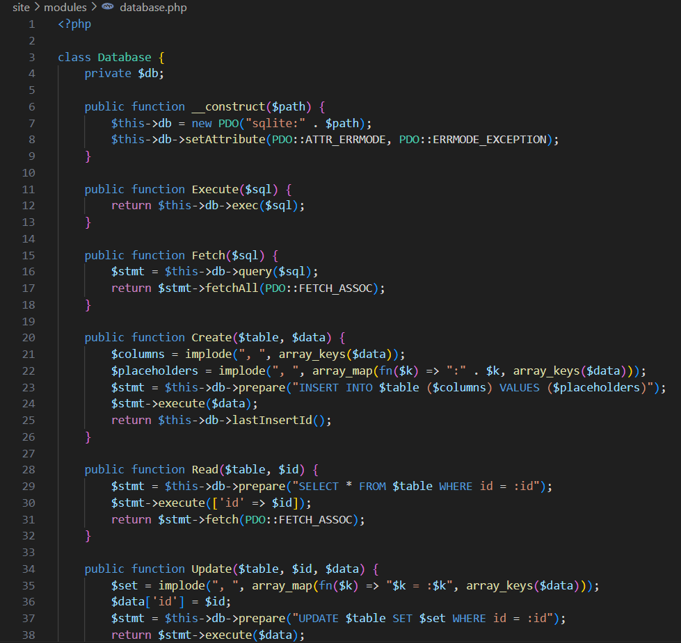

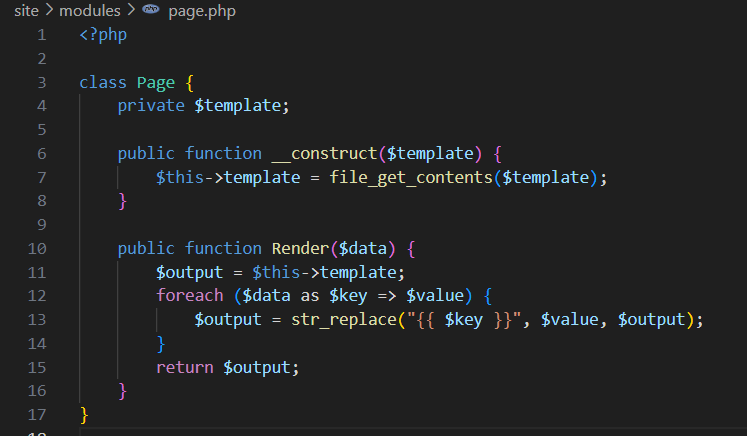

- `templates/` – conține fișierul `index.tpl`, un șablon HTML simplu.

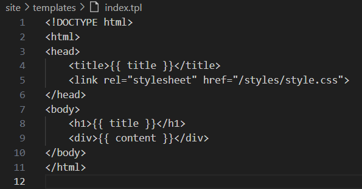

- `styles/` – conține fișierul `style.css`.

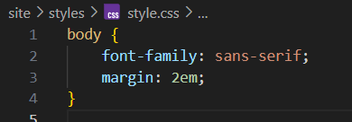

- `config.php` – definește configurația căii către fișierul bazei de date.

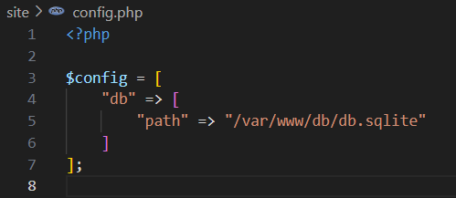

- `index.php` – scriptul principal care încarcă datele din baza de date și le afișează.

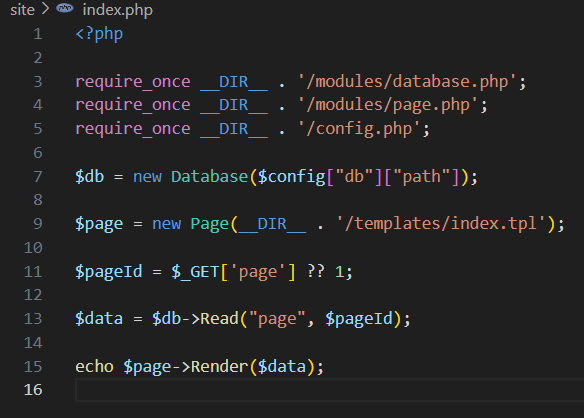

-`schema.sql` pregătirea fișierului SQL pentru baza de date.

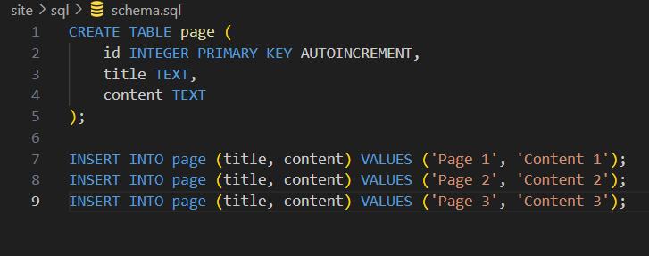


### 2. Teste
În directorul `tests/` au fost definite:
- Un framework simplu de testare (`testframework.php`).

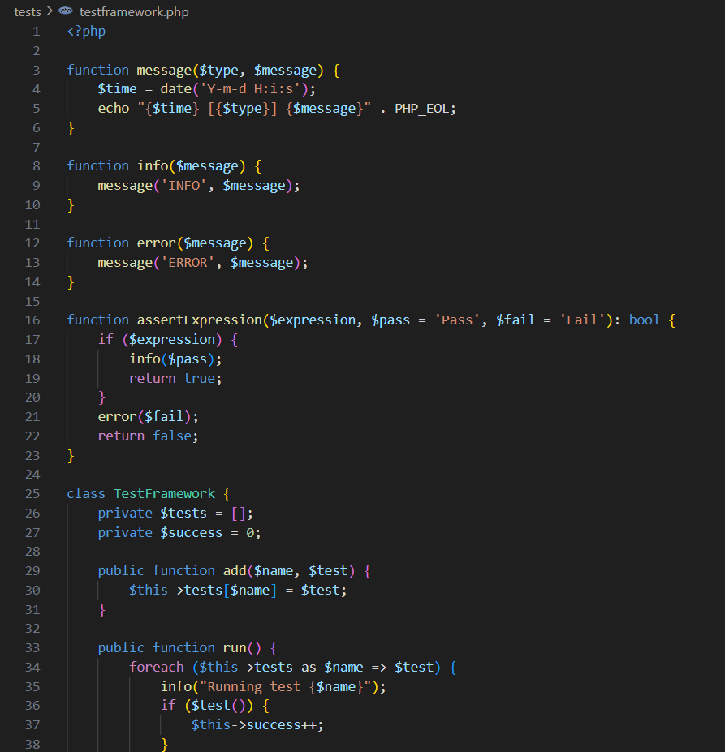

- Teste unitare pentru toate metodele claselor `Database` și `Page` în fișierul `tests.php`.

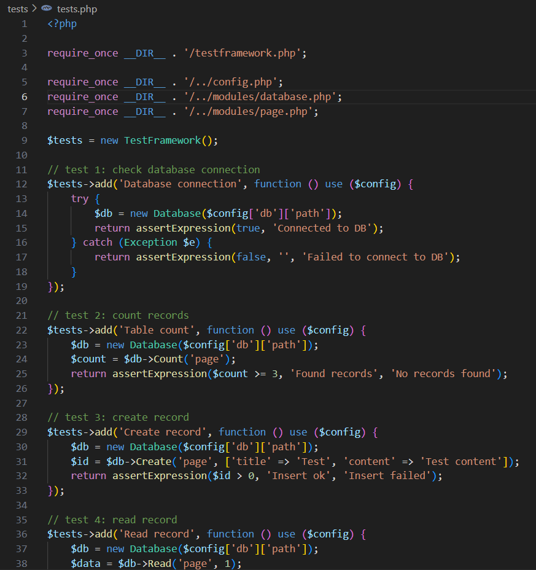

### 3. Docker
Fișierul `Dockerfile` creează o imagine PHP 7.4 cu suport pentru SQLite și:
- Instalează SQLite și extensia PHP necesară.
- Creează baza de date folosind fișierul `schema.sql`.
- Copiază aplicația web în container.

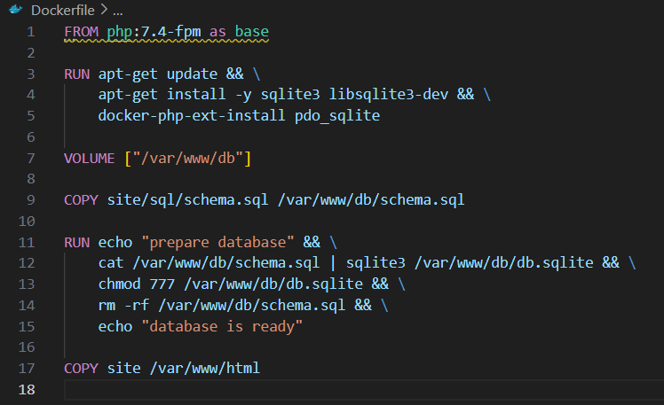

### 4. GitHub Actions
Fișierul `.github/workflows/main.yml` definește un workflow care:
- Rulează la fiecare `push` și `pull_request` pe ramura `main`.
- Construiește imaginea Docker.
- Creează și pornește un container din imagine.
- Rulează testele din container.
- Curăță resursele după rularea testelor.

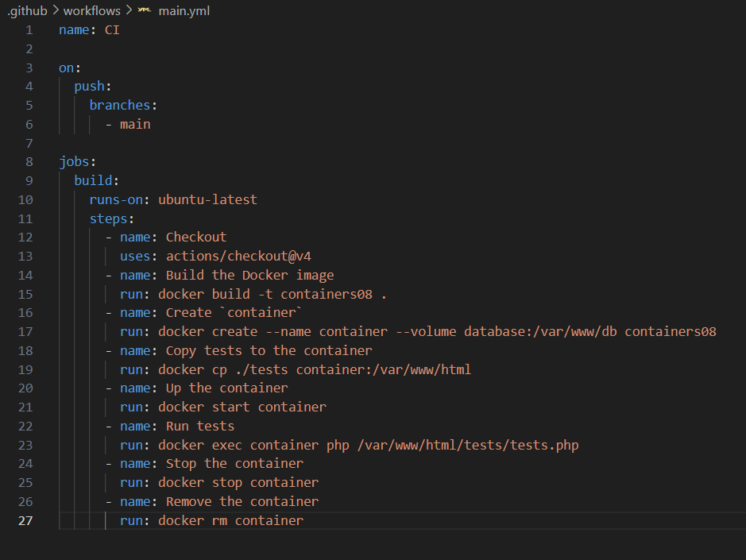

### 5. Pornire si Testare
Testele au fost trecute cu succes.

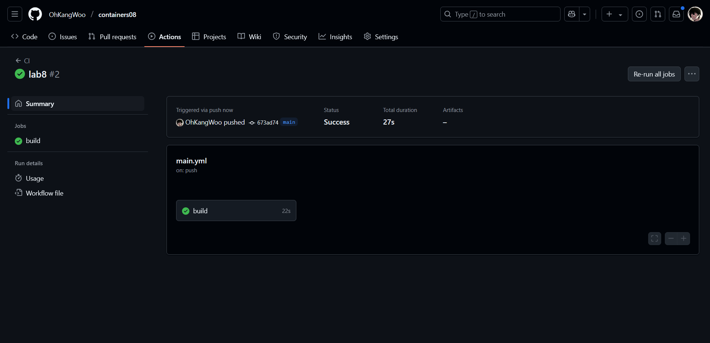
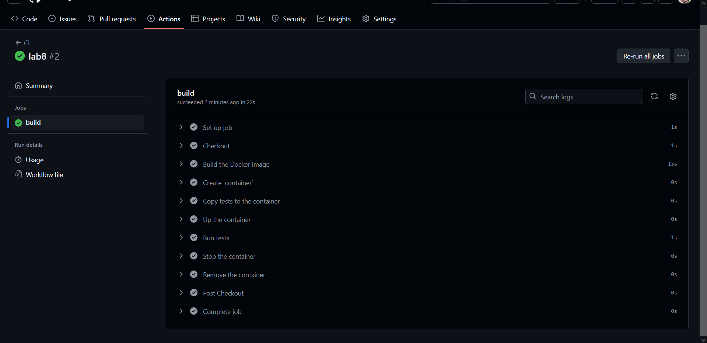


## Răspunsuri la întrebări

### Ce este integrarea continuă?
Integrarea continuă (CI) este o practică de dezvoltare software prin care modificările aduse codului sursă sunt integrate frecvent într-un depozit partajat, urmate de execuția automată a testelor. Scopul este de a detecta rapid erorile, de a reduce conflictele și de a crește calitatea codului.

### Pentru ce sunt necesare testele unitare? Cât de des trebuie să fie executate?
Testele unitare sunt folosite pentru a verifica funcționalitatea corectă a fiecărei componente individuale a aplicației. Ele permit detectarea timpurie a erorilor și facilitează dezvoltarea codului fără a introduce defecte în funcționalitatea existentă. Testele unitare ar trebui executate automat la fiecare modificare a codului (push, pull request), cât mai des posibil.

### Care modificări trebuie făcute în fișierul `.github/workflows/main.yml` pentru a rula testele la fiecare solicitare de trage (Pull Request)?
Se adaugă secțiunea:

```yaml
on:
  push:
    branches:
      - main
  pull_request:
    branches:
      - main
```

Astfel, workflow-ul va fi declanșat atât la push pe ramura `main`, cât și la crearea sau actualizarea unui pull request către această ramură.

### Ce trebuie adăugat în fișierul `.github/workflows/main.yml` pentru a șterge imaginile create după testare?
Se adaugă următorul pas la finalul workflow-ului pentru a elimina imaginea Docker:

```yaml
- name: Remove Docker image
  run: docker rmi containers08 || true
```

Această comandă asigură curățarea mediului de test și eliberarea de resurse.

## Concluzii
Această lucrare de laborator a demonstrat cum poate fi integrată o aplicație web simplă într-un mediu de dezvoltare modern, folosind containere Docker și GitHub Actions pentru integrare continuă. Procesul automatizat de testare asigură stabilitatea aplicației și reduce riscul introducerii de erori în codul sursă. De asemenea, am înțeles importanța testării automate și a proceselor DevOps în dezvoltarea software modernă.
